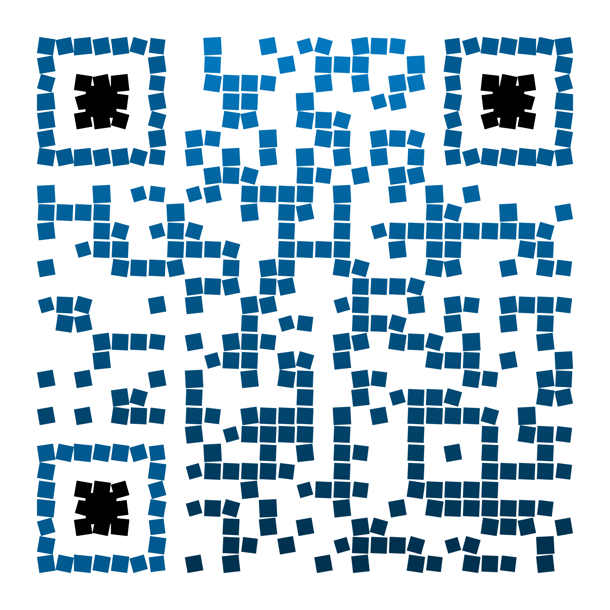
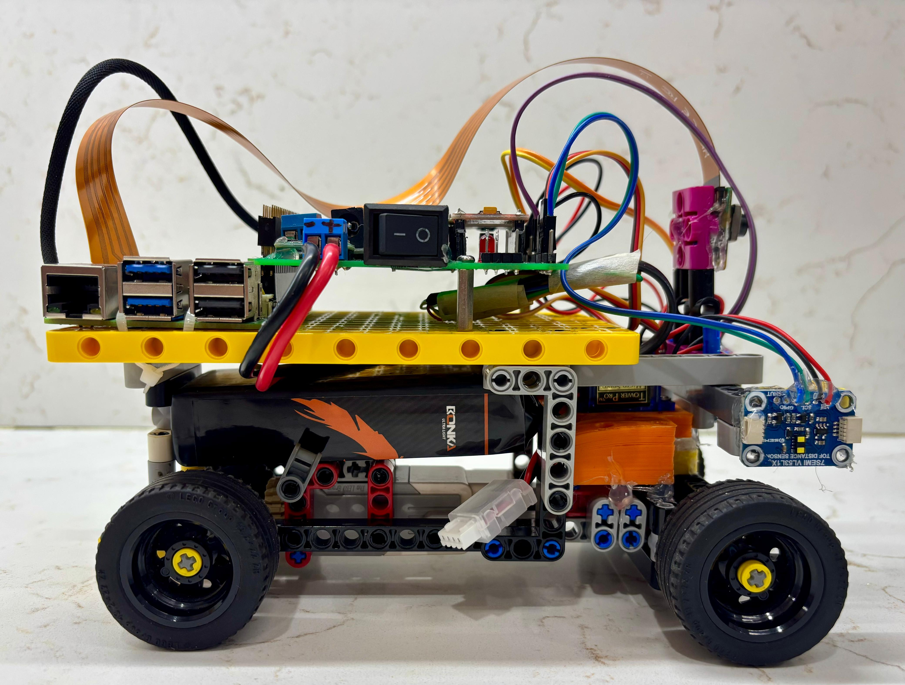
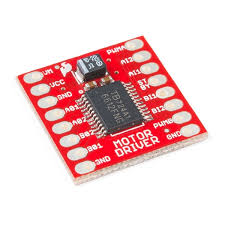

|  |  |
| :----------------------------------------------------------- | -----------------------------------------------------------: |
| Scan QR to open Github repo                                  |                                Scan QR to open YouTube video |

<div style="font-family: Baskerville; font-size: 28px; text-align: center; font-style: italic;">
    This Incredible Repository
</div>

Welcome to the Greenbotics 2025 repository! This repository contains everything we've worked on over the past ten months, including all our code and resources. You can also use this repository as a complete guide to understand and reconstruct the robot from the ground up.

## Table of Contents

- [The Team](#the-team)
- [The Challenge](#the-challenge)
  - [Our Vision](#our-vision)
  - [Skills We Learned](#skills-we-learned)
- [Photos of our Robot](#photos-of-our-robot)
- [Robot Performance Video](#robot-performance-video)
- [Mobility Management](#mobility-management)
  - [Powertrain](#powertrain)
  - [Steering System](#steering-system)
  - [Chassis](#chassis)
  - [Code for mobility components](#code-for-mobility-components)
- [Power and Sense Management](#power-and-sense-management)
  - [LiPo battery](#lipo-battery)
  - [Raspberry Pi](#raspberry-pi)
  - [Voltage Converter](#voltage-converter)
  - [Printed Circuit Board (PCB)](#printed-circuit-board-pcb)
  - [Camera](#camera)
  - [IMU](#imu)
  - [Distance Sensor](#distance-sensor)
  - [Multiplexer](#multiplexer)
  - [Code for sensors](#code-for-sensors)
- [Obstacle Management](#obstacle-management)
  - [Open Challenge Navigation Algorithm](#open-challenge-navigation-algorithm)
    - [Potential improvements in Open Navigation Algorithm](#potential-improvements-in-open-navigation-algorithm)
  - [Obstacle Challenge Navigation Algorithm](#obstacle-challenge-navigation-algorithm)
    - [Potential improvements in Obstacle Navigation Algorithm](#potential-improvements-in-obstacle-navigation-algorithm)
- [Engineering Factors](#engineering-factors)
  - [Design evolution](#design-evolution)
  - [From Nationals to Internationals!](#from-nationals-to-internationals)
- [Robot construction guide](#robot-construction-guide)
  - [1: Print the 3D parts](#1-print-the-3d-parts)
  - [2: Assemble the steering and drive train](#2-assemble-the-steering-and-drive-train)
  - [3: Attach the 3D mounts](#3-attach-the-3d-mounts)
  - [4: Fabricate the PCB](#4-fabricate-the-pcb)
  - [5: Soldering the electronics and gradual safe startup](#5-soldering-the-electronics-and-gradual-safe-startup)
  - [6: Download the code](#6-download-the-code)
  - [7: Robot stability](#7-robot-stability)
- [Major challenges faced](#major-challenges-faced)
- [How we used Github](#how-we-used-github)
- [Bill of Materials](#bill-of-materials)

# The Team


<p style="text-align:center;">Yes. We did know the camera was on!</p>

---

|  | Devansh<br/>Hi! I’m Devansh doing my second WRO season. Last year I represented India in the RoboMission category coming #25 in Internationals. This year I wanted a new challenge and learn new things. My hobbies are coding and robotics. |
| ------------------------------------------------------------ | ------------------------------------------------------------ |
|  | **Sheel**<br/>**Hi! I'm Sheel. I'm 15, and doing my second WRO season. Last year, our team made it to the International Finals in Robomission Junior. Additionally, I'm learning competitive debate. I also have a dog, and both of us are obsessed with Monkeys.** |
|  | **Rakshith**<br/>**I'm Rakshith, a 9th grader passionate about robotics and aspiring to study engineering in Germany. I love building drones, experimenting with sensors. I also have 3 dogs, and two of them live with my grandparents in Hyderabad.** |
|  | **Paresh Gambhava**<br/>**Mr. Paresh Gambhava is our chief coach from The Robotronics Club Ahmedabad. He is a robotics enthusiast, and electrical engineer by profession. He has vast experience training students for Robotics competition and projects.** |

<p style="page-break-before: always;"></p>

# The Challenge

The [Future Engineer Challenge](https://wro-association.org/wp-content/uploads/WRO-2025-Future-Engineers-Self-Driving-Cars-General-Rules.pdf "View the season rulebook") for the 2025 WRO Season involves building an autonomous vehicle that can complete two challenges. The first challenge is the Open Challenge. This challenge involves the robot completing three full laps on the field. The field consists of outer boundary walls, and 4 inner walls that are randomly placed to form a closed rectangle.

The second challenge is the Obstacle Challenge. In the Obstacle Challenge red or green cuboids called Traffic Signs are placed along the course. The robot must complete three laps around the track while making sure to pass the red traffic signs from the left, and the green traffic signs from the right. The Obstacle Challenge also has a dedicated Parking Space. The robot must start and end in the parking space to attain full points. The walls placement is fixed for the Obstacle Challenge.

## Our Vision

With a deep interest in robotics and programming, the WRO Future engineers challenge was a great opportunity for us to work and build a robot together. We had been seeing other teams in our institute work on this problem last year, and it was greatly motivating for us to see them work. Having represented India in last years WRO RoboMission, we were excited to participate in new category and learn new things.

## Skills We Learned

**Technical Skills:**

- 3D printing and design
- PCB design and creation
- Raspberry Pi programming
- Computer vision and camera programming
- Hardware integration

**Soft Skills:**

- Teamwork
- Problem-solving
- Not go crazy when the robot doesn’t behave as expected !!!

# Photos of our Robot

We designed our robot with Raspberry Pi 5 as the main brain of the car. Raspberry Pi 5 had pre-integrations with the camera allowing us to use faster smarter image procesing algorithms which is critical in this robots design.
Having spent a lot of time working on LEGO-based hardware in the 2024 season, we chose to use many LEGO parts for our Robot's Hardware.  However the robot also uses a Raspberry Pi, Raspberry Pi camera, and other off the shelf electronic components.

|                           Top view                           |                         Bottom view                          |
| :----------------------------------------------------------: | :----------------------------------------------------------: |
|  |  |

|                          Front view                          |                          Rear view                           |
| :----------------------------------------------------------: | :----------------------------------------------------------: |
|  |  |


|                          Left view                           | Right view                                                   |
| :----------------------------------------------------------: | ------------------------------------------------------------ |
|  |  |

# Robot Performance Video

This video shows robot's construction, open challenge run as well as obstacle challenge run.

| [](https://www.youtube.com/watch?v=yn76rDG4Hm4) |  <br />Scan QR code to open in YouTube |
| ------------------------------------------------------------ | ------------------------------------------------------------ |


---

# Mobility Management

Our robot's mobility system is designed around a LEGO-based chassis that balances ease of assembly with reliable performance. We selected a LEGO EV3 Medium Motor for propulsion due to its compatibility with our modular design approach, delivering 240-250 RPM at 9V through a differential drivetrain that enables smooth turning by allowing wheels to rotate at different speeds. For precise steering control, we integrated an SG90 servo motor with a custom 3D-printed mount that connects to our LEGO chassis. The TB6612FNG motor driver manages power delivery and speed control, while all components are securely mounted to our LEGO framework using standard connectors and custom PCB integration. This design prioritizes modularity and maintainability while providing the torque and precision needed for autonomous navigation challenges.

## Powertrain

### Motor

We chose to use a standard LEGO EV3 Medium Motor, as it easily integrates with the lego chassis and lego axle. This motor also embeds an encoder which could be used if required. However, the standard Lego connector doesn’t directly connect to our motor driver, therefore we identified the pinout of the LEGO motor and directly connected the wires to the motor driver. The pinout diagram of Lego EV3 motor is shown below


---
<table>
  <tr>
    <td width="50%" style="text-align: left;">
      
    </td>
    <td width="50%" style="text-align: left; vertical-align: top;">
      <h3>Specifications:</h3>
      <li>Name: LEGO EV3 Motor</li>
      <li>Voltage: 9V</li>
      <li>No Load Speed: 240 to 250 RPM</li>
      <li>Weight: 40g</li>
      <li>Encoder resolution: 1°</li>
    </td>
  </tr>
</table>


---

**Potential improvements:**

- Use the built-in encoder for more accurate movement and turns of the robot. Using the encoder allows for precise and accurate movements, helping in complex tasks like parking.

- Consider exploring more powerful non-Lego geared motors that are

    -Compact and lightweight

    -More powerful

    -Cheaper


### Drivetrain

Our EV3 motor is connected to a Lego axle that drives a gear connected to a Lego differential, which splits torque between two wheels. The differential lets both wheels rotate at different speeds when turning, thereby reducing the friction at each wheel, and making turns smoother. We used lego wheels as they are compatible with lego axle used for the chassis. We experimented with a wide variety of Lego wheels for the robot. Increasing the size of the rear wheel increased the robot speed almost linearly proportional to the wheel diameter. Increasing the width of the front tyres caused the robot to skid during turns, hence the front wheels are narrower to make smooth turns. The rear wheels are wider to provide sufficient friction to the vehicle.


**Potential Improvements**

- Explore alternative differential gear mechanisms to avoid the wheels slipping, especially on the smooth surface of the mat.
- Explore options for front wheels with vertical treads as the Lego narrow wheels do not have tread.


### Motor Driver

To control the current received by the motor and to control the speed of the drive motor, we utilized a SparkFun Dual TB6612FNG motor driver. The motor driver is connected to our PCB, and receives signals from the Raspberry Pi.

<table>
  <tr>
    <td width="50%" style="text-align: left;">
      
    </td>
    <td width="50%" style="text-align: left; vertical-align: top;">
      <h3>Specifications:</h3>
      <li>Name: TB6612FNG</li>
      <li>Power Supply Voltage: 15V (Max)</li>
      <li>Average Output current: 1.2A</li>
      <li>Peak Output current: 3.2A</li>
      <li>Standby control to save power</li>
      <li>Built-in thermal shutdown circuit</li>
    </td>
  </tr>
</table>


**Potential Improvements:**

- Explore motor driver that can output higher currents, if we upgrade existing motors to higher performance motors

## Steering System

For our steering mechanism, we needed a design that was precise. Like all other aspects of our robot’s design, our first choice was to use a Lego based mechanism. Ackerman steering is a popular choice in automobiles, as the front inner wheel turns more than the front outer wheel, thereby reducing skid. However it was complicated to build it. We first tried the simpler parallel steering mechanism and it turned out to be pretty good for our robot, so we didn't consider Ackerman steering.

The steering could have been driven by any encoder based motor (such as a spike prime small motor) as a makeshift servo motor. The problem was, that while any Lego motor would have been both highly precise and easy to integrate, even the smallest motor was too bulky and required integration with motor driver.

Therefore, we decided to use an off the shelf servo motor, which was not only small but can be driven directly by Raspberry Pi's output port. To integrate it with our Lego based design, we 3D printed a custom servo mount which could be attached with Lego screws to the front of the chassis directly behind the front wheel, while simultaneously hot gluing the servo horn to 3D printed component that couples the horn to the axle of the front wheels.

**Potential Improvements:**

- Explore if Ackerman steering provides better maneuverability.

### Servo Motor

Our steering system is centered around the SG90 servo motor, which provides precise angular control, making it highly suitable for steering applications where accuracy is essential. Unlike standard DC motors, the SG90 has a built-in feedback mechanism that allows it to hold a commanded angle reliably without additional sensors. Despite its compact size, it delivers sufficient torque to handle the demands of turning the steering mechanism, ensuring stability.

<table>
  <tr>
    <td width="50%" style="text-align: left;">
      
    </td>
    <td width="50%" style="text-align: left; vertical-align: top;">
      <h3>Specifications:</h3>
      <li>Name: SG90</li>
      <li>Operating voltage: 3.0V - 7.2V</li>
      <li>Weight: 9g</li>
    </td>
  </tr>
</table>

<table>
  <tr>
    <td width="50%" style="text-align: left;">
      
    </td>
    <td width="50%" style="text-align: left; vertical-align: top;">
      <h3>Servo mount</h3>
      <li>To connect the servo motor to our robot, we designed and 3D printed a custom Servo Mount</li>
      <li>A diagram of our servo mount is shown to the left.</li>
      <li>A 3D Printable file is provided in the models folder.</li>
    </td>
  </tr>
</table>


**Challenges:**

For a brief period, we used an MG90 servo motor instead of our current SG90 motor. An MG90 has metal gears instead of plastic gears, which we believed would make it more reliable. However, the MG90 gears broke in one of our test runs, and we reverted back to the SG90

**Potential Improvements:**

- 3D print the servo horn to directly connect to the chassis without gluing

<p style="page-break-before: always;"></p>

## Chassis

When starting this project, we realized that the bulk of our effort would go into building autonomous driving software. As we wanted to spend more time on software, and had already spent a considerable amount of time using Lego hardware for our 2024 Robomission challenge, we **custom designed** the base chassis from elementary Lego parts and rest of the chassis with **3D printed parts**.

This approach has many benefits, the primary one being ease of integration. Lego parts can easily be snapped on and off, making chassis development far easier and less time consuming. Making changes to a non-Lego chassis would have meant that each time we wanted to make a change to our chassis, we would have to make new 3D prints, increasing time, cost, waste and materials used.

All sensors like the camera, ultrasonic sensors and TOF sensors are attached to the base chassis with 3D printed mounts. This provides robust attachment of the the sensors to the main body. The prototype was built with hot gluing these sensors to the body but this wasn't robust and would come off.

|  |  |
| ------------------------------------------------------------ | ------------------------------------------------------------ |
|  |  |

|  |
| :----------------------------------------------------------: |

**Potential Improvements:**

- Despite being mounted on a thick 3D-printed mount, the camera vibrates when the robot is in motion, blurring the image. The mount could be coupled with vibration damping material.
- Lightweight suspension can be added to the chassis to enhance stability.
- The Raspberry Pi's cooling fan can be covered with a custom 3D printed cover to avoid dust and debris getting into the fan.
- The current 3D printed parts are printed with 100% infill for robustness but it increases the weight. We could explore an optimum infill that gives the minimum strength at the lowest possible weight.

## Code for mobility components

### Motor Control

Controls the drive motor speed and direction using PWM (pulse-width modulation) signals sent to the TB6612FNG motor driver.

#### Initialization

```python
def initialize():
    """Initializes the DC motor driver and PWM."""
    global gpio_handle, motor_pwm
    try:
        gpio_handle = lgpio.gpiochip_open(0)
        lgpio.gpio_claim_output(gpio_handle, config.AIN1_PIN)
        lgpio.gpio_claim_output(gpio_handle, config.AIN2_PIN)
        lgpio.gpio_claim_output(gpio_handle, config.STBY_PIN)
        
        motor_pwm = HardwarePWM(
            pwm_channel=config.MOTOR_PWM_CHANNEL,
            hz=config.MOTOR_PWM_FREQ,
            chip=config.MOTOR_PWM_CHIP,
        )
        motor_pwm.start(0)
        print("INFO: Motor Initialized.")
        return True
    except Exception as err:
        print(f"FATAL: Motor failed to initialize: {err}")
        return False
```

**Explanation:** We set up the GPIO pins that control the motor direction (AIN1, AIN2) and standby mode (STBY). We also initialize the PWM signal that controls motor speed.

#### Motor Control Functions

```python
def forward(speed):
    """Drives the motor forward at a given speed."""
    if gpio_handle:
        lgpio.gpio_write(gpio_handle, config.STBY_PIN, 1)  # Enable motor
        lgpio.gpio_write(gpio_handle, config.AIN1_PIN, 1)  # Forward direction
        lgpio.gpio_write(gpio_handle, config.AIN2_PIN, 0)
        _set_speed(speed)  # Set speed 0-100

def reverse(speed):
    """Drives the motor in reverse at a given speed."""
    if gpio_handle:
        lgpio.gpio_write(gpio_handle, config.STBY_PIN, 1)  # Enable motor
        lgpio.gpio_write(gpio_handle, config.AIN1_PIN, 0)  # Reverse direction
        lgpio.gpio_write(gpio_handle, config.AIN2_PIN, 1)
        _set_speed(speed)

def brake():
    """Brakes the motor by shorting its terminals."""
    if gpio_handle:
        lgpio.gpio_write(gpio_handle, config.STBY_PIN, 1)
        lgpio.gpio_write(gpio_handle, config.AIN1_PIN, 1)  # Both pins high = brake
        lgpio.gpio_write(gpio_handle, config.AIN2_PIN, 1)
        _set_speed(0)
```

**Explanation:** These functions control motor direction by setting the AIN1 and AIN2 pins. Forward sets AIN1=1 and AIN2=0. Reverse does the opposite. Brake sets both to 1, which stops the motor quickly.

---

### Servo Steering

Controls the steering servo angle using PWM signals. The servo position determines the steering direction.

#### Initialization

```python
def initialize():
    """Initializes the servo motor PWM."""
    global servo_pwm
    
    for attempt in range(1, 6):  # Try up to 5 times
        try:
            servo_pwm = HardwarePWM(
                pwm_channel=config.SERVO_PWM_CHANNEL,
                hz=config.SERVO_PWM_FREQ,
                chip=config.SERVO_PWM_CHIP,
            )
            servo_pwm.start(0)
            set_angle(0.0)  # Center the servo
            time.sleep(0.5)
            print("INFO: Servo Initialized.")
            return True
        except PermissionError as err:
            print(f"WARNING: Servo PWM permission denied (attempt {attempt}/5): {err}")
            time.sleep(0.1 * attempt)
    
    print("FATAL: Servo failed to initialize after 5 attempts")
    return False
```

**Explanation:** We initialize the PWM signal for the servo. The servo needs a specific frequency (50 Hz) and pulse width to set its angle. We center it at 0 degrees during startup.

#### Servo Angle Control

```python
def set_angle(input_angle: float):
    """Sets the servo to a specific angle (-45 to +45 degrees)."""
    if servo_pwm is None:
        return
    
    # Clamp angle to safe limits
    clamped_angle = max(-45, min(45, input_angle))
    
    # Convert angle to PWM duty cycle
    # Servo expects 1-2ms pulse width at 50Hz frequency
    pulse_width_ms = 1.5 + (clamped_angle / 90) * 0.5
    duty_cycle = (pulse_width_ms / 20) * 100
    
    servo_pwm.change_duty_cycle(duty_cycle)
```

**Explanation:** Servo motors work by receiving a PWM signal with a specific pulse width. A 1.5ms pulse = center (0°), 1ms = full left (-90°), 2ms = full right (+90°). We calculate the duty cycle based on the desired angle.

# Power and Sense Management

Our robot uses a Raspberry Pi 5 to process data from several sensors. We use ultrasonic and TOF sensors for distance, an IMU for orientation, and a camera for autonomous driving. A Li-Po battery powers the entire system.

## LiPo battery

Our robot uses a Bonka 11.1V 2200mAh LiPo battery, commonly found in drones and quadcopters. We chose this battery because its compact form factor fits in the narrow space beneath the chassis. Mounting the heavy battery low in the robot lowers the center of mass, which improves stability.

<table>
  <tr>
    <td width="50%" style="text-align: left;">
      
    </td>
    <td width="50%" style="text-align: left; vertical-align: top;">
      <h3>Specifications:</h3>
      <li>Maximum Voltage: 12.6V </li>
      <li>Nominal Voltage: 11.1V </li>
      <li>Capacity: 2200mAh</li>
      <li>Discharge Current: 35C</li>
      <li>Weight: 175g</li>
    </td>
  </tr>
</table>


---
**Potential Improvements**

- Implement a battery level indicator
- Explore if a Lithium-Ion battery is available in the required form factor, as it

    - Is safer

    - Has more charge cycles

    - Doesn't require a complex charger that a LiPo requires
    
    - Can be easily removed and replaced with another charged battery
---
## Raspberry Pi

The heart of our robot is the Raspberry Pi 5 microcomputer. It processes inputs from our distance sensors, runs image processing algorithms on the live camera feed and controls the motors to drive the robot to achieve its desired goals.

We chose this particular model as it seamlessly integrates with a camera, making it easier to use than similar computers or microcontrollers such as an Arduino or ESP32. Additionally, we also wanted to take advantage of the Raspberry Pi 5 being far more powerful than other processors, allowing us to use newer and improved image processing technologies that deliver more accurate results but may require greater computing power.

**Potential Improvements**

- Use Arduinos and compatible cameras to make this robot much cheaper to design


<table>
  <tr>
    <td width="50%" style="text-align: left;">
      
    </td>
    <td width="50%" style="text-align: left; vertical-align: top;">
      <h3>Specifications:</h3>
      <li>Name: Raspberry Pi 5 </li>
      <li>RAM: 8GB</li>
      <li>Pins: 40</li>
      <li>Input Voltage: 5V</li>
    </td>
  </tr>
</table>

## Voltage Converter

Our battery provides 12V, but our Raspberry Pi requires 5V and our motor requires 9V. To supply these lower voltages safely, we used a XY-3606 step-down (buck) voltage converter.

**Potential Improvements**

- Use a linear converter to reduce costs
- Use a buck converter that is more efficient and provides more power at different voltages. This ensures that all components running at all voltages can be used

<table>
  <tr>
    <td width="50%" style="text-align: left;">
      
    </td>
    <td width="50%" style="text-align: left; vertical-align: top;">
      <h3>Specifications:</h3>
      <li>Name: XY-3606 </li>
      <li>Working voltage: DC 9V–36V</li>
      <li>Output voltage: 5.2V</li>
    </td>
  </tr>
</table>


## Printed Circuit Board (PCB)

In our first draft of the robot, there were many criss-crossing wires between many different components. A lack of clean arrangement for the wires made the robot very messy to handle. During practice runs, wires would routinely get loose, making it difficult to troubleshoot errors.

To solve this, we designed a PCB which cleanly connected all of our components together, making the robot far cleaner and reliable.

Here is a comparison showing our robot before and after the PCB

| Before                                                       | After                                                        |
| ------------------------------------------------------------ | ------------------------------------------------------------ |
|  |  |

<table>
  <tr>
    <td width="50%" style="text-align: left;">
      
    </td>
    <td width="50%" style="text-align: left; vertical-align: top;">
      <h3>PCB</h3>
      <li>This is our PCB image with all components mounted</li>
      <li>The 'models/PCB' folder contains the files required to print this PCB</li>
    </td>
  </tr>
</table>
<p style="page-break-before: always;"></p>

## Camera

For image detection, we are using the Raspberry Pi Camera Module 3. This uses a CMOS sensor, the Sony IMX708. Apart from its ease of integration with the Raspberry Pi, the Camera module 3 has autofocus, wide-angle and low-light performance, all of which are very useful in a competition setting.

We explored few other alternatives as well. The Raspberry Pi AI camera provides built in detection for many objects, but has a limited Field Of View which didn't work for our requirements. The Raspberry Pi HQ camera though bulky comes with a standard CS mount that allowed us to mount different fish eye lenses. A fish eye lens camera provides a much larger Field Of View (160° - 180°) even when mounted in the front on a straight mount at 10cm height. This allows us to cut off the field view above the black walls making the robot resilient to off field objects. However the image is distorted towards the edges and tuning the robot to detect objects proved difficult for us.


<table>
  <tr>
    <td width="50%" style="text-align: left;">
      
    </td>
    <td width="50%" style="text-align: left; vertical-align: top;">
      <h3>Specifications:</h3>
      <li>Name: Camera Module 3 </li>
      <li>Resolution: 11.9 megapixels</li>
      <li>Horizontal/vertical: 4608 × 2592 pixels</li>
      <li>Autofocus, Wide-angle and Low-light performance</li>
    </td>
  </tr>
</table>


**Potential Improvements**

- Use an alternative wide angle AI camera to process data on the camera itself. This will reduce processing load on the Raspberry Pi.
- Attempt to resolve tuning issues with fish eye camera to ignore off field objects.

## IMU

Our robot uses the BNO055 IMU (Inertial Measurement Unit) to help it maintain direction when moving straight, and to make turns more accurate. The BNO055 combines data from an accelerometer, gyroscope, and magnetometer to provide absolute orientation, which reduces drift and allows the robot to correct its heading in real time.

<table>
  <tr>
    <td width="50%" style="text-align: left;">
      
    </td>
    <td width="50%" style="text-align: left; vertical-align: top;">
      <h3>Specifications:</h3>
      <li>I2C Address: 0x28 </li>
      <li>Gyroscope: Range ±125°/s to ±2000°/s</li>
      <li>Accelerometer: Range ±2g, ±4g, ±8g, ±16g</li>
    </td>
  </tr>
</table>

**Potential Improvements**

- Move the IMU away from areas of magnetic interference
- Use higher quality IMUs such as the BNO085

## Distance Sensor

Apart from the camera, our robot uses TOF based distance sensors VL53L1X / VL53L8CX and URM09 Ultrasonic sensor to gather inputs. The sensors are mounted on the front, back, left, and right of the robot respectively. The front and back sensors are used to avoid hitting the parking walls. The left and right sensors are used to detect the starting direction for obstacle challenge. They could potentially be used for a surprise rule that may be announced at the competition.

**Reasons for using different sensors**

- Ultrasonic sensors are not affected by strong lighting at competition arenas and are useful to detect objects at larger distance. This is useful for wall detection.
- Some TOF sensors could potentially be affected by strong lighting at competition arenas, but are usually safe over short distances. This is useful for parking.
  - The back sensor is attached to the edge of the rear chassis hence requires min 2cm range.
  - The front sensor is attached to the inner cavity behind the front wheels hence can work with 4cm range.

<table>
  <tr>
    <td width="50%" style="text-align: left;">
      
    </td>
    <td width="50%" style="text-align: left; vertical-align: top;">
      <h3>VL53L1X Specifications:</h3>
      <li>Operating Voltage: 3.3V </li>
      <li>Range: 4cm to 4m</li>
      <li>Resolution: 1mm</li>
    </td>
  </tr>
  <tr>
    <td width="50%" style="text-align: left;">
      
    </td>
    <td width="50%" style="text-align: left; vertical-align: top;">
      <h3>VL53L8CX Specifications:</h3>
      <li>Operating Voltage: 3.2V to 5.5V </li>
      <li>Range: 2cm to 4m</li>
      <li>Resolution: 1mm</li>
    </td>
  </tr>  
  <tr>
    <td width="50%" style="text-align: left;">
      
    </td>
    <td width="50%" style="text-align: left; vertical-align: top;">
      <h3>URM09 Specifications:</h3>
      <li>Operating Voltage: 3.3V to 5.5V</li>
      <li>Range: 2cm to 5m</li>
      <li>Resolution: 1cm</li>
    </td>
  </tr>
</table>


**Alternatives considered**

Along with the Ultrasonic and VL53L1X sensors, we also considered LiDAR sensors to help map the game field. In the end, though, we decided to pass on this, as LiDAR sensors are too expensive. Adding a single LiDAR sensor could have increased the robot's cost by nearly 40%. Additionally, at the short ranges relevant to this game field, our existing ultrasonic and ToF sensors already provide sufficient accuracy, so LiDAR would not have meaningfully improved the robot’s accuracy.

**Potential Improvements**

- Use a lidar sensor for a complete 2D image of the surroundings

## Multiplexer

All four of our distance sensors share the same I²C address. Our CJMCU TCA9548A multiplexer splits the  distance sensors into separate channels so only one device is active at a time. This gives each device a “virtual” unique address, letting them coexist without conflict.

<table>
  <tr>
    <td width="50%" style="text-align: left;">
      
    </td>
    <td width="50%" style="text-align: left; vertical-align: top;">
      <h3>Specifications:</h3>
      <li>Model Number: CJMCU TCA9548A </li>
      <li>No. of Channels: 8 </li>
    </td>
  </tr>
</table>
## Bringing it all together


<p style="page-break-before: always;"></p>

**A full wiring diagram is shown in the screenshot below, and available at models/PCB/~Untitled.kicad_sch**


## Code for sensors

### IMU (Gyroscope) - BNO055

Measures the robot's heading (direction) using a combination of gyroscope, accelerometer, and magnetometer sensors.

#### Initialization

```python
def initialize():
    """Initializes the BNO055 sensor."""
    global sensor
    
    try:
        i2c = board.I2C()
        sensor = adafruit_bno055.BNO055_I2C(i2c)
        sensor.mode = adafruit_bno055.NDOF_MODE  # 9-DOF mode
        time.sleep(1)  # Let sensor boot up
        
        print(f"INFO: Gyro (BNO055) Initialized. Temp: {sensor.temperature}°C")
        print(f"INFO: Calibration status: {sensor.calibration_status}")
        return True
    except Exception as e:
        print(f"WARNING: Gyro disabled. Could not initialize: {e}")
        sensor = None
        return True
```

**Explanation:** We initialize the BNO055 on the I2C bus and set it to NDOF mode (9-Degree of Freedom), which uses all three sensors together for accurate heading measurement.

#### Reading Heading

```python
def get_heading():
    """Returns the current heading (yaw) in degrees."""
    if sensor:
        try:
            heading, _, _ = sensor.euler  # Get yaw (heading) from Euler angles
            if heading is not None:
                return heading
        except Exception:
            return None
    return None

def get_initial_heading(num_readings=20):
    """Gets an averaged, stable initial heading."""
    if not sensor:
        return 0.0
    
    print("INFO: Acquiring initial heading...")
    readings = []
    for _ in range(num_readings):
        yaw = get_heading()
        if yaw is not None:
            readings.append(yaw)
        time.sleep(0.05)
    
    if readings:
        initial_heading = np.mean(readings)
        print(f"INFO: Gyro zero point set to: {initial_heading:.2f} degrees.")
        return initial_heading
    return 0.0
```

**Explanation:** The BNO055 returns Euler angles (heading, roll, pitch). We extract the heading (yaw) which tells us which direction the robot is facing. We average multiple readings at startup to get a stable initial heading.

---

### Camera - Raspberry Pi Camera Module 3

Captures video frames for obstacle detection and color identification using computer vision.

#### Initialization

```python
def initialize():
    """Initializes the Picamera2."""
    global picam2
    try:
        picam2 = Picamera2()
        cam_config = picam2.create_preview_configuration(
            main={
                "format": "RGB888",
                "size": (2304, 1296),  # High resolution for processing
            },
            lores={
                "size": (640, 360),    # Low resolution for fast processing
                "format": "RGB888"
            },
            controls={
                "ExposureTime": 8000,  # Exposure time in microseconds
                "FrameRate": 56,       # Frames per second
            }
        )
        picam2.configure(cam_config)
        picam2.start()
        time.sleep(1.0)
        print("INFO: Camera Initialized.")
        return True
    except Exception as e:
        print(f"FATAL: Camera failed to initialize: {e}")
        return False
```

**Explanation:** We set up the camera with two resolutions: high resolution (2304×1296) for detailed processing and low resolution (640×360) for fast real-time processing. We also set exposure time and frame rate for consistent image quality.

#### Capturing Frames

```python
def capture_frame():
    """Captures and returns a single frame from the camera."""
    if picam2:
        frame = picam2.capture_array("lores")  # Get low-res frame for speed
        return frame
    return None
```

**Explanation:** We capture frames from the low-resolution stream for fast processing. This lets us run obstacle detection at 30 FPS without slowing down the robot.

### Distance Sensors - VL53L1X

Measures distance to walls and obstacles using time-of-flight (ToF) technology. Four sensors are mounted on the front, back, left, and right.

#### Initialization

```python
def initialise():
    """Initializes the I2C bus, multiplexer, and all distance sensors."""
    global _i2c_main, _mux, _sensors, _sensor_types
    
    try:
        _i2c_main = busio.I2C(board.SCL, board.SDA)
    except Exception as e:
        print(f"FATAL: Could not initialize I2C bus. Error: {e}")
        return False
    
    try:
        _mux = adafruit_tca9548a.TCA9548A(_i2c_main, address=0x70)
        print("INFO: TCA9548A Mux found at address 0x70.")
    except ValueError:
        print("WARNING: TCA9548A Mux not found.")
        _mux = None
    
    # Probe each channel for sensors
    if _mux:
        print("INFO: Probing for sensors on mux channels...")
        for i in range(8):
            channel_bus = _mux[i]
            
            try:
                vl53_sensor = adafruit_vl53l1x.VL53L1X(channel_bus)
                vl53_sensor.distance_mode = 1
                vl53_sensor.timing_budget = 50
                vl53_sensor.start_ranging()
                _sensors[i] = vl53_sensor
                _sensor_types[i] = 'VL53L1X'
                print(f"  - SUCCESS: VL53L1X found on channel {i}.")
            except (ValueError, OSError):
                print(f"  - INFO: No sensor found on channel {i}.")
    
    print("INFO: Sensor initialization complete.")
    return True
```

**Explanation:** We initialize the I2C bus and the TCA9548A multiplexer. The multiplexer lets us connect 4 sensors with the same I2C address by switching between channels. We probe each channel and initialize any VL53L1X sensors we find.

#### Reading Distance

```python
def get_distance(channel):
    """Reads the distance from a sensor on a specific channel."""
    if channel not in _sensors:
        return None
    
    sensor = _sensors[channel]
    
    try:
        if sensor.data_ready:  # Check if new data is available
            distance_cm = sensor.distance
            sensor.clear_interrupt()
            return distance_cm * 10.0 if distance_cm is not None else None
        return None  # No new data yet
    except (OSError, IOError):
        print(f"I/O Error on channel {channel}. Sensor may be disconnected.")
        return None
```

**Explanation:** We check if the sensor has new data ready. If it does, we read the distance in centimeters and convert it to millimeters. If no new data is ready, we return None immediately without blocking.

# Obstacle Management

## Open Challenge Navigation Algorithm

Navigate 3 laps using camera-based wall detection steering straight in the straight sections. Steer according to the driving section in the corner section. Count turns using orange lines. Stop after 12 turns.

### How it works

1. Detect black walls using HSV color masks
2. Calculate left vs right wall area
3. Steer toward bigger wall (proportional steering)
4. Detect orange lines for turn counting
5. Execute sharp turns when close wall detected
6. Stop after 12 turns

### Flowchart


### Steering

- Calculate difference between two wall areas
- If one side wall disappears, means we are in a turn, turn sharply towards the other side
- Otherwise turn with regular Kp=0.0005

#### Code

```python
left_pixel_size = sum(obj['area'] for obj in detected_walls if 'left' in obj['type'])
right_pixel_size = sum(obj['area'] for obj in detected_walls if 'right' in obj['type'])

# If one side wall disappears, turn sharply towards the other side
if left_pixel_size < 100 and right_pixel_size > 100:
    right_pixel_size += 25000
elif right_pixel_size < 100 and left_pixel_size > 100:
    left_pixel_size += 25000
              
angle = ((left_pixel_size - right_pixel_size) * 0.0005)
```

### Turn Counting
- Detect orange lines in specific ROI
- Keep history of last 4 frames
- Increment counter on no line → line transition
- Use 50-frame cooldown to prevent double-counting

#### Code

```python
orange_detection_history = deque([False] * 4, maxlen=4)
cooldown_frames = 0
orange_detected_this_frame = bool(detections['detected_orange'])
orange_detection_history.append(orange_detected_this_frame)

if cooldown_frames > 0:
    cooldown_frames -= 1
elif not orange_detection_history[-4] and all(list(orange_detection_history)[1:]):
    turn_counter += 1
    cooldown_frames = 50
```

### Sharp Turn Detection
- If close wall area > 3000 pixels: execute sharp turn
- Angle = ±35 degrees
- Prevents collision

#### Code

```python
close_black_area = sum(obj['area'] for obj in detections.get('detected_close_black', []))
if close_black_area > 3000:
    if left_pixel_size < right_pixel_size:
        angle = -35
    else:
        angle = 35
```

### Potential improvements in Open Navigation Algorithm

- Instead of driving in the center of the lane, drive towards the inner wall which could reduce time further. This requires careful tuning of the turns to avoid hitting the walls.

## Obstacle Challenge Navigation Algorithm

Navigate 3 laps while avoiding colored blocks. Drive left of the green block and right of the red block. Detect the driving direction automatically. Count turns using orange lines. Avoid the magenta parking blocks in all laps. Execute parallel parking just before the vehicle approaches the 13th orange line.

### How it works

1. Detect driving direction (clockwise vs counter-clockwise)
2. Perform initial maneuver (85° turn with scanning)
3. Navigate main loop with block avoidance
4. Count turns using orange/blue lines
5. Execute parking at turn 13

### Flowchart


### Driving Direction Detection

1. Compare left vs right distance sensor readings
2. If left < right: clockwise
3. If right < left: counter-clockwise

#### Code

```python
dist_left = sensor_thread.get_readings()['distance_left']
dist_right = sensor_thread.get_readings()['distance_right']

if dist_left is not None and dist_right is not None:
    if dist_left < dist_right:
        driving_direction = "clockwise"
    else:
        driving_direction = "counter-clockwise"
```

### Initial maneuver

This is the logic for counter clockwise. The logic for clockwise would be mirrored

1. Head out of the parking in slanted orientation
2. scan for blocks (1 second)
3. If red block: reverse and take a right turn
4. If green block: drive forward and take a right turn
5. If no block: drive slanted 1s
6. Return to main loop

#### Flowchart


#### Code

```python
SCAN_TRIGGER_ANGLE_DEG = 25.0
TOTAL_TURN_ANGLE_DEG = 85.0

motor.forward(MANEUVER_SPEED)
servo.set_angle_unlimited(initial_turn_servo)

while get_angular_difference((INITIAL_HEADING+SCAN_TRIGGER_ANGLE_DEG)%360, 
                             imu_thread.get_heading()) > 10:
    time.sleep(0.01)

motor.brake()
# Scan for blocks
detected_block_color = None
scan_start_time = time.monotonic()

while time.monotonic() - scan_start_time < 1.0:
    frame, frame_counter = camera_thread.get_frame()
    if frame is None: continue
    detections = process_video_frame(frame)
    main_blocks = [b for b in detections.get('detected_blocks', []) if b['type'] == 'block']
    
    if main_blocks and main_blocks[0]['area'] > 1000:
        detected_block_color = main_blocks[0]['color']
        break
```

### **Color Detection**

Detect 6 different colors to identify walls, blocks, turn lines, and parking boundaries. Each color serves a specific purpose in navigation and obstacle avoidance.

1. Convert frame to HSV color space
2. Apply Gaussian blur
3. Create masks for each color
4. Apply ROI masks (region of interest)
5. Find contours (outlines)
6. Filter by minimum area
7. Calculate centroid (center point)

#### Flowchart


#### Code

```python
def process_video_frame(frame):
    hsv_frame = cv2.cvtColor(frame, cv2.COLOR_BGR2HSV)
    
    mask_red1 = cv2.inRange(hsv_frame, [0, 150, 80], [10, 255, 255])
    mask_red2 = cv2.inRange(hsv_frame, [175, 150, 80], [180, 255, 255])
    mask_red = cv2.bitwise_or(mask_red1, mask_red2)
    
    mask_green = cv2.inRange(hsv_frame, [36, 50, 70], [89, 255, 255])
    mask_orange = cv2.inRange(hsv_frame, [6, 70, 20], [26, 255, 255])
    mask_magenta = cv2.inRange(hsv_frame, [158, 73, 64], [173, 255, 223])
    mask_blue = cv2.inRange(hsv_frame, [94, 45, 58], [140, 226, 185])
    
    # Apply ROI masks and find contours
    # ... contour detection logic
```

### Regions of Interest

**Why multiple ROIs?**

- Faster processing (less data)
- More accurate (fewer false detections)
- Better performance (40 FPS maintained)

#### 7 ROI Masks

1. **Left Wall ROI** - Detect left wall for steering
2. **Right Wall ROI** - Detect right wall for steering
3. **Inner Left Wall ROI** - Detect inner walls
4. **Inner Right Wall ROI** - Detect inner walls
5. **Main Block ROI** - Detect red/green blocks ahead
6. **Close Block ROI** - Detect blocks very close (emergency)
7. **Line ROI** - Detect orange/blue lines for turns

### Block avoidance

Detect colored blocks (red and green) and execute appropriate maneuvers to avoid them. Handle both emergency situations (very close blocks) and normal avoidance (blocks ahead).

**Close Blocks (Emergency Reverse):**

- Very close to robot
- Execute emergency maneuver: reverse, turn servo, drive forward

**Main Blocks (Steering Avoidance):**
- Ahead of robot but not too close
- Calculate steering to pass correctly:
  - Red: pass from right side
  - Green: pass from left side

#### Flowchart


#### Code

```python
if detected_blocks:
    is_close_block = False
    for block in detected_blocks:
        if block['type'] == 'close_block':
            is_close_block = True
            if block['color'] == 'red':
                angle = -25
            elif block['color'] == 'green':
                angle = 30
            servo.set_angle(angle)
            motor.reverse(60)
            time.sleep(0.5)
            motor.forward(60)
            servo.set_angle(-angle)
            time.sleep(0.3)
            motor.forward(MOTOR_SPEED)
            break
    
    if not is_close_block:
        block = detected_blocks[0]
        block_color = block['color']
        block_x, block_y = block['centroid']
        
        if block_color == 'red':
            target = 150
            angle = ((block_x - (320 - target)) * 0.09) + 1
        elif block_color == 'green':
            target = 150
            angle = ((block_x - (320 + target)) * 0.1) + 1
```

### Parking logic

Execute parallel parking maneuver in two directions (clockwise and counter-clockwise). Use wall following and magenta block detection to position robot precisely at the parking start point. Then execute a parking maneuver to park parallely between parking boundaries.

1. Drive forward until front sensor close to wall
2. Reverse until back sensor close to wall
3. Drive forward taking a left turn entering the parking section
4. Line following mode by tracking black wall on left side at fixed pixel
5. Stop at the second magenta block
6. Park parallelly with the help of IMU and servo

#### Sketch


### Threading Architecture

Threading allows the robot to process multiple tasks simultaneously:
- Capture camera frames
- Read gyro heading
- Read distance sensors
- Write video to file
- Control motors

#### 4 Threads

**CameraThread:**

- Continuously captures frames (~30 FPS)
- Stores latest frame in memory
- Main loop reads this frame

**ImuThread:**
- Continuously reads gyro heading (~100 Hz)
- Stores latest heading in memory
- Main loop reads this heading

**SensorThread:**
- Continuously reads distance sensors (~50 Hz)
- Stores latest readings in memory
- Main loop reads these readings

**VideoWriterThread:**
- Continuously writes frames to MP4
- Receives frames from main loop
- Writes to disk in background

#### Thread Synchronization
Use locks (mutexes) to prevent simultaneous access to shared data. Only one thread can access data at a time.

### Potential improvements in Obstacle Navigation Algorithm

- Experiment with LAB color detection if it resolves some of the color detection problems we face with HSV
- Use Machine Learning to train a model for navigating around parking blocks within the walls and use this model to drive the robot.
- Use Machine Learning to train a model for parallel parking and use it to park the robot
- Use encoder (instead of time based driving) to park more accurately during parallel parking.

# Engineering Factors

## Design evolution

We started building the robot in mid of January 2025 and here is a timeline of our robot evolution over the last 10 months!

1. We designed our own robot chassis with differential gear axle and steering

   |  |  |
   | ------------------------------------------------------------ | ------------------------------------------------------------ |

2. First prototype of motor attachment with vertical orientation secured by zip ties

   |  |
   | :----------------------------------------------------------: |

   <p style="page-break-before: always;"></p>

3. 3D printed assembly to attach servo motor to steering

   |  |
   | :----------------------------------------------------------: |

4. Mounted Raspberry Pi5 on a cardboad sheet, battery, power converter, axle motor, motor driver and servo motor for steering

   |  |
   | :----------------------------------------------------------: |

   <p style="page-break-before: always;"></p>

5. Adding a camera so that our robot can see!

   |  |
   | :----------------------------------------------------------: |

6. Moving the components to a lego base plate to make it more stable

   |  |
   | :----------------------------------------------------------: |

   <p style="page-break-before: always;"></p>

7. Attaching the lego base plate to the robot chassis along with distance sensors

   |  |
   | :----------------------------------------------------------: |

8. All components connected with wires and bread board power rail for electrical prototyping

   |  |
   | :----------------------------------------------------------: |

   <p style="page-break-before: always;"></p>

9. A jungle of wires!

   |  |  |
   | ------------------------------------------------------------ | ------------------------------------------------------------ |

10. Tied the wires neatly and upgraded the sensors

    |  |      |
    | :----------------------------------------------------------: | ---- |

    <p style="page-break-before: always;"></p>

11. Created a custom PCB to solve the wire mess and to make the connections reliable

    |  |  |
    | ------------------------------------------------------------ | ------------------------------------------------------------ |
    |  |  |

12. Moved to a custom PCB

    |  |  |
    | ------------------------------------------------------------ | ------------------------------------------------------------ |

    <p style="page-break-before: always;"></p>

13. Aligned the battery so that it doesn't protrude outside the robot

    |  |
    | :----------------------------------------------------------: |


<p style="page-break-before: always;"></p>

## From Nationals to Internationals!

- Changed the driving logic from basic object color detection to consider X axis position of the object, resulting in human like driving
-  Used camera to drive between the walls instead of relying on sensors.
-  Designed custom 3D printed mounts for camera, sensors and servo horn.

|  |  |
| ------------------------------------------------------------ | ------------------------------------------------------------ |
| Changed the wheels and designed a custom 3D printed camera mount. Moved the camera to vehicle rear to improve FOV. | Designed a custom 3D printed sensor mount for stable mounting of distance sensors. Designed a 3D printed horn coupling for servo motor. |

# Robot construction guide

## 1: Print the 3D parts
- The STL part files for the mounts for servo motor, servo horn, camera base, camera arm and sensors are in the `models/chassis` folder. Recommended settings
  - Material: PLA
  - Infill: 100%


## 2: Assemble the steering and drive train
- Create the steering assembly using the Lego parts in the photos
- Attach the two rear wheels with a differential gear assembly using Lego gears and axle
- Attach the Lego EV3 medium motor with Lego pins to the chassis
- The Lego motor gears should mesh with the differential gear
- Attach the front wheels

|  |  |  |
| :----------------------------------------------------------- | ------------------------------------------------------------ | ------------------------------------------------------------ |


## 3: Attach the 3D mounts
- Mount the servo on the 3D printed servo motor mount
- Attach the servo horn to the steering with 3D printed servo horn mount
- Attach the servo mount to the chassis using Lego pins
- Attach the Camera base mount to the rear part of the chassis
- Attach the Camera arm mount to the base mount using screws
- Use zip ties if necessary


## 4: Fabricate the PCB
- Fabricate the PCB from the KiCAD files in the `models/PCB` folder using KiCAD (https://www.kicad.org/)
## 5: Soldering the electronics and gradual safe startup
- Solder all the headers to the PCB
- Solder the power modules
- Attach the battery and verify if Raspberry Pi5 boots up
- Solder the startup switch and LED and verify if it can be programmed using a test program
- Attach the motor driver module to the header pins and verify if motors can be controlled using a test program
- Attach the multiplexer module to the header pins and verify if sensors can be read using a test program
- Attach the IMU module to the header pins and verify if orientation values can be read using a test program
- Attach the Raspberry Pi5 wide angle camera


## 6: Download the code
- Connect the Raspberry Pi5 to a monitor, keyboard and mouse
- Install python dependencies
  - `pip3 install adafruit-circuitpython-bno055`
  - `pip3 install adafruit-circuitpython-tca9548a`
  - `pip3 install adafruit-circuitpython-vl53l1x`
- Download the code from the `src` folder to the Raspberry Pi5
- Run the code!
  - `/src/open_challenge/main.py` for Open challenge
  - `/src/obstacle_challenge/main_v3.py` for Obstacle challenge
## 7: Robot stability
- Run the robot and hopefully should run great!
- If the gears make a grinding noise, it is likely due to the lego components not tightly coupled. Use zip ties to ensure the chassis beams are tightly connected.

# Major challenges faced

### Sensor

One major challenge we faced was in working with the VL53L8CX ToF sensor. We have placed it on the back of our robot to aid in parking, but it was extremely unreliable and onerous to work with during testing. The sensor lacked a dedicated Python library (only providing a C-based library), and refused to communicate through our I²C multiplexer. These limitations made integration unexpectedly difficult for us.

To connect this sensor, we first created our own Python version of the C library. Then, we moved the sensor to a secondary I²C bus to bypass the multiplexer and eliminate communication conflicts. 

The sensor failed roughly once in every twenty readings. We wanted to make the sensor more reliable. To solve, this, we went deep into the technical documentation of the sensor and realised that the Raspberry Pi ports were configured as pull down instead of pull ups. Since this fix the sensor has never failed.

### Camera

Another major challenge arose when we tried to use a fish-eye lens in place of our camera for image detection. We wanted to use a fish-eye lens, as it had a wider Field Of View (195 degrees) than our Raspberry Pi Camera Module 3 (120 degrees)

Unfortunately, this didn’t work out. The fish-eye camera has a circular lens, which means all images we received were distorted and circular. This made it difficult to calculate their area, which hindered accuracy. Oftentimes, blocks would be detected either too early or too late. While we could have attempted to add circular ROIs, this would have added significant complexity to the bot and would have required extensive tuning.

# How we used Github

Our team used Github to store all of our code such that it is accessible to all team members and to those who wish to use this repository in the future. We have made frequent commits to this repository, and this repository stands as testament to our efforts, and the process of design as a whole

### The Structure of This Repository

* `t-photos` contains 2 photos of the team (an official one and one funny photo with all team members)
* `v-photos` contains 6 photos of the vehicle (from every side, from top and bottom)
* `video` contains the video.md file with the link to a video where driving demonstration exists
* `schemes` contains several schematic diagrams of the electronic components, chassis, circuit diagram and 3D part images
* `src` contains code of control software for all components which were programmed to participate in the competition
* `models` is for the design files for models used for 3D printing and PCB manufacturing
* `other` is for other files which can be used to understand how to prepare the vehicle for the competition.

<p style="page-break-before: always;"></p>

### Source code organization

```python
src/
├── motors/
│   ├── motor.py          # DC motor control
│   ├── servo.py          # Servo steering control
│   └── test_pwm.py       # PWM testing
├── sensors/
│   ├── camera.py         # Camera module interface
│   ├── distance.py       # Distance sensor reading
│   ├── bno055.py         # IMU/Gyro sensor
│   ├── color_tuning.py   # Color detection tuning
│   └── vl53l1x.py        # ToF sensor driver
├── open_challenge/
│   ├── main.py           # Open challenge algorithm
│   └── config.py         # Configuration parameters
└── obstacle_challenge/
    ├── main_v3.py        # Obstacle challenge algorithm
    ├── config.py         # Configuration parameters
    └── nationals/        # National competition version
```

### 


# Bill of Materials

| Component | Make and Model | Price | Quantity | Total Price | Component Purchase Link |
|-------------------|--------------------------------|-------|----------|-------------|------------------------|
| Single Board Computer | Raspberry Pi 5 (8GB) | 8291 | 1 | 8291 | https://robu.in/product/raspberry-pi-5-model-8gb/ |
| Camera Module | Raspberry Pi Camera Module 3 | 3551 | 1 | 3551 | https://www.silverlineelectronics.in/products/copy-of-test-1 |
| IMU Sensor | BNO055 9-DOF Intelligent Sensor | 2001 | 1 | 2001 | https://robu.in/product/df-robot-febno055-intelligent-9-axis-sensor-rmion-bno055-intelligent-9-axis-sensor-breakout/ |
| Distance Sensor | VL53L1X ToF Distance Sensor (4-400cm range) | 668 | 1 | 668 | https://robocraze.com/products/vl53l1x-tof-distance-sensor-breakout-with-4-meter-range-7semi |
| Distance Sensor | VL53L8CX ToF Distance Sensor (2-400cm range) | 1892 | 1 | 1892 | https://www.fabtolab.com/pololu-3419-vl53l8cx-time-of-flight-8-8-zone-distance-sensor-carrier-voltage-regulators-400cm-max |
| Distance Sensor | URM09 Ultrasonic Distance Sensor | 1150 | 2 | 2300 | https://wiki.dfrobot.com/URM09_Ultrasonic_Sensor_(Gravity-I2C)_(V1.0)_SKU_SEN0304 |
| I2C Multiplexer | CJMCU TCA9548A 8-Channel I2C Multiplexer | 75 | 1 | 75 | https://robu.in/product/cjmcu-tca9548a-i2c-8-channel-multiple-extensions-development-board/ |
| Servo Motor | TowerPro SG90 9g Mini Servo | 94 | 1 | 94 | https://robu.in/product/towerpro-sg90-9g-mini-servo-9-gram/ |
| Drive Motor | LEGO EV3 Medium Motor | 1500 | 1 | 1500 | https://www.brickowl.com/catalog/lego-mindstorms-ev3-medium-motor-99455 |
| Motor Driver | TB6612FNG Dual Motor Driver Module | 161 | 1 | 161 | https://robu.in/product/motor-driver-tb6612fng-module-performance-ultra-small-volume-3-pi-matching-performance-ultra-l298n/ |
| Battery | Bonka 11.1V 2200mAh 35C LiPo Battery | 1959 | 1 | 1959 | https://www.flyrobo.in/11.1v-2200mah-35c-3s1p-bonka-lipo-battery-bonka-high-capacity-lipo-battery |
| Voltage Converter | XY-3606 24V/12V to 5V 5A Power Module | 160 | 1 | 160 | https://robu.in/product/24v-12v-to-5v-5a-power-module-dc-dc-xy-3606-power-converter/ |
| Mechanical Components | LEGO Mindstorms EV3 (some parts)| 2000 | 1 | 2000 | https://www.brickowl.com/catalog/lego-mindstorms-ev3-set-31313 |
| Differential Gear | LEGO Differential Gear | 150 | 1 | 150 | https://www.brickowl.com/catalog/lego-differential-gear-casing-with-bevel-gear-on-end-with-open-center-62821 |
| Custom PCB | Custom Designed PCB | 6579 | 1 | 6579 | https://www.pcbpower.com/ |
| 3D Printed Parts | Servo mounts, Sensor mount, Camera mounts | 200 | 5 | 1000 |  |
| Total |  |  |  | 32381 | INR |
