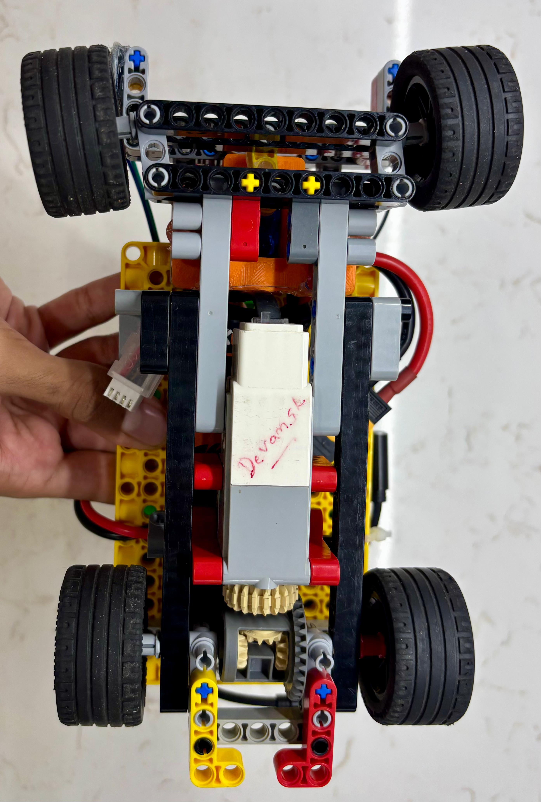
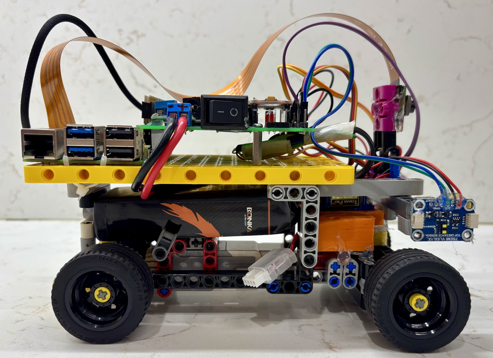

|  |  |
| :----------------------------------------------------------- | -----------------------------------------------------------: |
| Scan QR to open Github repo                                  |                                Scan QR to open YouTube video |

### **This Incredible Repository**

Welcome to the Greenbotics 2025 repository! This repository contains everything we've worked on over the past eight months, including all our code and resources. You can also use this repository as a complete guide to understand and reconstruct the robot from the ground up.

[TOC]

---

# The Team


<p style="text-align:center;">Yes. We did know the camera was on!</p>

---

|  | **Devansh**<br/>Hi! I’m Devansh doing my second WRO season. Last year I represented India in the RoboMission category coming #25 in Internationals. This year I wanted a new challenge and learn new things. My hobbies are coding and robotics. |
| ------------------------------------------------------------ | ------------------------------------------------------------ |
|  | **Sheel**<br/>Hi! I'm Sheel. I'm 15, and doing my second WRO season. Last year, our team made it to the International Finals in Robomission Junior. Additionally, I'm learning competitive debate. I also have a dog, and both of us are obsessed with Monkeys. |
|  | **Rakshith**<br/>I'm Rakshith, a 9th grader passionate about robotics and aspiring to study engineering in Germany. I love building drones, experimenting with sensors. I also have 3 dogs, and two of them live with my grandparents in Hyderabad. |
|  | **Paresh Gambhava**<br/>Mr.Paresh Gambhava is our chief coach from The Robotronics Club Ahmedabad. He is a robotics enthusiast, and electrical engineer by profession. He has vast experience training students for Robotics competition and projects. |


# The Challenge

The [Future Engineer Challenge](https://wro-association.org/wp-content/uploads/WRO-2025-Future-Engineers-Self-Driving-Cars-General-Rules.pdf "View the season rulebook") for the 2025 WRO Season involves building an autonomous vehicle that can complete two challenges. The first challenge is the Open Challenge. This challenge involves the robot completing three full laps on the field. The field consists of outer boundary walls, and 4 inner walls that are randomly placed to form a closed rectangle.

The second challenge is the Obstacle Challenge. In the Obstacle Challenge red or green cuboids called Traffic Signs are placed along the course. The robot must complete three laps around the track while making sure to pass the red traffic signs from the left, and the green traffic signs from the right. The Obstacle Challenge also has a dedicated Parking Space. The robot must start and end in the parking space to attain full points. The walls placement is fixed for the Obstacle Challenge.

## Our Vision

With a deep interest in robotics and programming, the WRO Future engineers challenge was a great opportunity for us to work and build a robot together. We had been seeing other teams in our institute work on this problem last year, and it was greatly motivating for us to see them work. Having represented India in last years WRO RoboMission, we were excited to participate in new category and learn new things.

## Skills We Learned

**Technical Skills:**

- 3D printing and design
- PCB design and creation
- Raspberry Pi programming
- Computer vision and camera programming
- Hardware integration

**Soft Skills:**

- Teamwork
- Problem-solving
- Not go crazy when the robot doesn’t behave as expected !!!

# Photos of our Robot

We designed our robot with Raspberry Pi 5 as the main brain of the car. Raspberry Pi 5 had pre-integrations with the camera allowing us to use faster smarter image procesing algorithms which is critical in this robots design.
Having spent a lot of time working on LEGO-based hardware in the 2024 season, we chose to use many LEGO parts for our Robot's Hardware.  However the robot also uses a Raspberry Pi, Raspberry Pi camera, and other off the shelf electronic components.

|                           Top view                           |                         Bottom view                          |
| :----------------------------------------------------------: | :----------------------------------------------------------: |
|  |  |

|                          Front view                          |                          Rear view                           |
| :----------------------------------------------------------: | :----------------------------------------------------------: |
|  |  |

|                       Left view                        | Right view                                               |
| :----------------------------------------------------: | -------------------------------------------------------- |
|  |  |

# Robot Performance Video

This video shows robot's construction, open challenge run as well as obstacle challenge run.

| [](https://youtu.be/55lUwe3Zd6s) |  <br />Scan QR code to open in YouTube |
| ------------------------------------------------------------ | ------------------------------------------------------------ |


---

# Mobility Management

Our robot's mobility system is designed around a LEGO-based chassis that balances ease of assembly with reliable performance. We selected a LEGO EV3 Medium Motor for propulsion due to its compatibility with our modular design approach, delivering 240-250 RPM at 9V through a differential drivetrain that enables smooth turning by allowing wheels to rotate at different speeds. For precise steering control, we integrated an SG90 servo motor with a custom 3D-printed mount that connects to our LEGO chassis. The TB6612FNG motor driver manages power delivery and speed control, while all components are securely mounted to our LEGO framework using standard connectors and custom PCB integration. This design prioritizes modularity and maintainability while providing the torque and precision needed for autonomous navigation challenges.

## Powertrain

### Motor

Keeping with the idea of a LEGO-Oriented design, we chose to use a standard LEGO EV3 Medium Motor. While this motor easily integrates with the chassis and axle, it doesn’t directly connect to our motor driver. Instead, we identified the pinout of the LEGO motor, and directly connected the wires to the motor driver. The pinout diagram is shown below


---
<table>
  <tr>
    <td width="50%" style="text-align: left;">
      
    </td>
    <td width="50%" style="text-align: left; vertical-align: top;">
      <h3>Specifications:</h3>
      <li>Name: LEGO EV3 Motor</li>
      <li>Voltage: 9V</li>
      <li>No Load Speed: 240 to 250 RPM</li>
      <li>Weight: 40g</li>
      <li>Encoder resolution: 1°</li>
    </td>
  </tr>
</table>


---

**Potential improvements:**

- Use a more powerful non-LEGO motor such as a 12V DC motor that is

    -Compact and lightweight

    -More powerful

    -Cheaper

- Use the built-in encoder for more accurate movement and turns of the robot. Using the encoder allows for movement inputs to be given in centimeters or degrees, rather than in time, helping in more complex tasks like parking.


### Drivetrain

Our EV3 motor is connected to a LEGO axle that drives a gear connected to a LEGO differential, which splits torque between two wheels. The differential lets both wheels rotate at different speeds when turning, thereby reducing the friction at each wheel, and making turns smoother.

**Potential Improvements**

- Use a different type of differential gear to avoid the wheels slipping, especially on the smooth surface of the mat.


### Motor Driver

To control the current received by the motor and to control the speed of the drive motor, we utilized a SparkFun Dual TB6612FNG motor driver. The motor driver is connected to our PCB, and receives signals from the Raspberry Pi.

<table>
  <tr>
    <td width="50%" style="text-align: left;">
      
    </td>
    <td width="50%" style="text-align: left; vertical-align: top;">
      <h3>Specifications:</h3>
      <li>Name: TB6612FNG</li>
      <li>Power Supply Voltage: 15V (Max)</li>
      <li>Average Output current: 1.2A</li>
      <li>Peak Output current: 3.2A</li>
      <li>Standby control to save power</li>
      <li>Built-in thermal shutdown circuit</li>
    </td>
  </tr>
</table>


**Potential Improvements:**

- Use a motor driver that can output higher currents, to allow for the use of higher performance motors

## Steering System

For our steering mechanism, we needed a design that was precise. Like all other aspects of our robot’s design, our first choice was to use a LEGO based mechanism. To do that we could have used any encoder based motor (such as a spike prime small motor) as a makeshift servo motor.

The problem was, that while any LEGO motor would have been both highly precise and easy to integrate, even the smallest motor was too bulky and required separate wires.

Therefore, we decided to use an off the shelf servo motor. To integrate it into our LEGO based design, we 3D printed a custom servo mount which could be attached with LEGO screws to the front of the chassis directly behind the front wheel, while simultaneously hot gluing the servo horn to the axle of the front wheels.

### Servo Motor

Our steering system is centered around the SG90 servo motor, which provides precise angular control, making it highly suitable for steering applications where accuracy is essential. Unlike standard DC motors, the SG90 has a built-in feedback mechanism that allows it to hold a commanded angle reliably without additional sensors. Despite its compact size, it delivers sufficient torque to handle the demands of turning the steering mechanism, ensuring stability.

<table>
  <tr>
    <td width="50%" style="text-align: left;">
      
    </td>
    <td width="50%" style="text-align: left; vertical-align: top;">
      <h3>Specifications:</h3>
      <li>Name: SG90</li>
      <li>Operating voltage: 3.0V - 7.2V</li>
      <li>Weight: 9g</li>
    </td>
  </tr>
</table>

<table>
  <tr>
    <td width="50%" style="text-align: left;">
      
    </td>
    <td width="50%" style="text-align: left; vertical-align: top;">
      <h3>Servo mount</h3>
      <li>To connect the servo motor to our robot, we designed and 3D printed a custom Servo Mount</li>
      <li>A diagram of our servo mount is shown to the left.</li>
      <li>A 3D Printable file is provided in the models folder.</li>
    </td>
  </tr>
</table>


**Potential Improvements:**

- 3D print the servo horn to directly connect to the LEGO Chassis.
- Try out different steering mechanisms such as the Ackermann system

## Chassis

When starting this project, we realized that the bulk of our effort must go into designing the autonomous driving used by this robot. As we wanted to spend more time on software, and having spent a considerable amount of time using LEGO hardware for our 2024 Robomission campaign, we decided to make a LEGO chassis.

The LEGO chassis has many benefits, the primary one being ease of integration. LEGO parts can easily be snapped on and off, making chassis development far easier and less time consuming. Making changes to a non-LEGO chassis would have meant that each time we wanted to make a change to our chassis, we would have to make new 3D prints, increasing time, cost, waste and materials used.

Our chassis consists of the components that make up the drivetrain and steering system. The current chassis supports our EV3 motor, differential gear, back wheels and axle, front wheels and axle, servo motor and servo mount.

# Power and Sense Management

Our robot receives inputs from off-the-shelf sensors that have been mounted on the robot. Additionally, it also uses a camera for the obstacle challenge. Inputs are processed by our Raspberry Pi. This entire assembly is powered by a Li-Po battery

## LiPo battery

Our robot uses the Bonka 11.1V 2200mAh 35C 3S Lithium Polymer (LiPo) battery. This LiPo battery is often used for drones and quadcopters. We picked this battery, as one of our team members had it readily available, and had used it in other projects beforehand. He found the battery reliable and hence we decided to use it.

<table>
  <tr>
    <td width="50%" style="text-align: left;">
      
    </td>
    <td width="50%" style="text-align: left; vertical-align: top;">
      <h3>Specifications:</h3>
      <li>Maximum Voltage: 12.6V </li>
      <li>Nominal Voltage: 11.1V </li>
      <li>Capacity: 2200mAh</li>
      <li>Discharge Current: 35C</li>
      <li>Weight: 175g</li>
    </td>
  </tr>
</table>


---
**Potential Improvements**

- Implement a battery level indicator
- Use a Lithium-Ion battery, as it

    - Is safer

    - Has more charge cycles

    - Allows for a smaller robot
---
## Raspberry Pi

The heart of our robot is the Raspberry Pi 5 microcomputer. It processes inputs from our distance sensors, runs image processing algorithms on the live camera feed and controls the motors to drive the robot to achieve its desired goals.

We chose this particular model as it seamlessly integrates with a camera, making it easier to use than similar computers or microcontrollers such as an Arduino or ESP32. Additionally, we also wanted to take advantage of the Raspberry Pi 5 being far more powerful than other processors, allowing us to use newer and improved image processing technologies that deliver more accurate results but may require greater computing power.

**Potential Improvements**

- Use Arduinos and compatible cameras to make this robot much cheaper to design


<table>
  <tr>
    <td width="50%" style="text-align: left;">
      
    </td>
    <td width="50%" style="text-align: left; vertical-align: top;">
      <h3>Specifications:</h3>
      <li>Name: Raspberry Pi 5 </li>
      <li>RAM: 8GB</li>
      <li>Pins: 40</li>
      <li>Input Voltage: 5V</li>
    </td>
  </tr>
</table>

## Voltage Converter

Our battery provides 12V, but our Raspberry Pi requires 5V and our motor requires 9V. To supply these lower voltages safely, we used a XY-3606 step-down (buck) voltage converter.

**Potential Improvements**

- Use a linear converter to reduce costs
- Use a buck converter that is more efficient and provides more power at different voltages. This ensures that all components running at all voltages can be used

<table>
  <tr>
    <td width="50%" style="text-align: left;">
      
    </td>
    <td width="50%" style="text-align: left; vertical-align: top;">
      <h3>Specifications:</h3>
      <li>Name: XY-3606 </li>
      <li>Working voltage: DC 9V–36V</li>
      <li>Output voltage: 5.2V</li>
    </td>
  </tr>
</table>


## Printed Circuit Board (PCB)

In our first draft of the robot, there were many criss-crossing wires between many different components. There was no clear arrangement for the wires, making the robot very messy and confusing to change. During practice runs, wires would routinely get loose, making it very difficult to troubleshoot errors.

To solve this, we designed a PCB which cleanly connected all of our components together, making the robot far cleaner and reliable.

Here is a comparison showing our robot before and after the PCB

| Before                                                       | After                                                        |
| ------------------------------------------------------------ | ------------------------------------------------------------ |
|  |  |

<table>
  <tr>
    <td width="50%" style="text-align: left;">
      
    </td>
    <td width="50%" style="text-align: left; vertical-align: top;">
      <h3>PCB</h3>
      <li>This is our PCB image with all components mounted</li>
      <li>The 'models/PCB' folder contains the files required to print this PCB</li>
    </td>
  </tr>
</table>
## Camera

For image detection, we are using the Raspberry Pi Camera Module 3. This uses a CMOS sensor, the Sony IMX708. Apart from its ease of integration with the raspberry pi reducing a major complexity for us, the Camera module 3 has autofocus, wide-angle and low-light performance, all of which are very useful in a competition setting.

<table>
  <tr>
    <td width="50%" style="text-align: left;">
      
    </td>
    <td width="50%" style="text-align: left; vertical-align: top;">
      <h3>Specifications:</h3>
      <li>Name: Camera Module 3 </li>
      <li>Resolution: 11.9 megapixels</li>
      <li>Horizontal/vertical: 4608 × 2592 pixels</li>
      <li>Autofocus, Wide-angle and Low-light performance</li>
    </td>
  </tr>
</table>


**Potential Improvements**

- Use the Raspberry Pi AI camera to process data on the camera itself. This will reduce processing load on the Raspberry Pi

## IMU

Our robot uses the BNO055 IMU (Inertial Measurement Unit) to help it maintain direction when moving straight, and to make turns more accurate. The BNO055 combines data from an accelerometer, gyroscope, and magnetometer to provide absolute orientation, which reduces drift and allows the robot to correct its heading in real time.

<table>
  <tr>
    <td width="50%" style="text-align: left;">
      
    </td>
    <td width="50%" style="text-align: left; vertical-align: top;">
      <h3>Specifications:</h3>
      <li>I2C Address: 0x28 </li>
      <li>Gyroscope: Range ±125°/s to ±2000°/s</li>
      <li>Accelerometer: Range ±2g, ±4g, ±8g, ±16g</li>
    </td>
  </tr>
</table>

**Potential Improvements**

- Move the IMU away from areas of magnetic interference
- Use higher quality IMUs such as the BNO085

## Distance Sensor

Apart from the camera, our robot also uses four VL53L1X distance sensors to gather inputs. The sensors are mounted on the front, back, left, and right of the robot respectively. The front sensor is used to avoid hitting the wall, while the back sensor is used during parking. The left and right sensors are used to detect when to take a turn.

<table>
  <tr>
    <td width="50%" style="text-align: left;">
      
    </td>
    <td width="50%" style="text-align: left; vertical-align: top;">
      <h3>Specifications:</h3>
      <li>Operating Voltage: 3.3V </li>
      <li>Range: 4m</li>
      <li>I2C Address: 0x29</li>
    </td>
  </tr>
</table>


**Potential Improvements**

- Use sensors like VL53L8CP for better, more accurate detection.
- Use a lidar sensor

## Multiplexer

All four of our distance sensors share the same I²C address. Our CJMCU TCA9548A multiplexer splits the 4 distance sensors into separate channels so only one device is active at a time. This gives each device a “virtual” unique address, letting them coexist without conflict.

<table>
  <tr>
    <td width="50%" style="text-align: left;">
      
    </td>
    <td width="50%" style="text-align: left; vertical-align: top;">
      <h3>Specifications:</h3>
      <li>Model Number: CJMCU TCA9548A </li>
      <li>No. of Channels: 8 </li>
    </td>
  </tr>
</table>

<p style="page-break-before: always;"></p>

## Bringing it all together


**A full wiring diagram is shown in the screenshot below, and available at models/PCB/~Untitled.kicad_sch**


# Obstacle Management

## Open Challenge Navigation Algorithm

For the Open Challenge, our robot uses the two distance sensors attached to the left and right sides of the robot. As the robot already starts in a straightforward section, it can directly enter the main movement loop.

The robot starts by measuring the distance between itself and the walls. If the readings from any of the sensors are 7cm or less, the robot must first move itself away from the walls to the center of the track.

The robot starts moving straight using readings from the attached IMU, while the left and right sensors start measuring the distance between the robot and the 2 sets of walls. The bot will continue moving forward until one of its sensors returns a NULL reading. Our distance sensors cannot measure distances greater than 2m, and will return NULL if such a situation arises. On the WRO course, this can only occur when the inner wall ends at a corner, leaving open space till the wall on the opposite side of the track. When this occurs the robot knows to take a turn. If the right sensor returns a NULL reading, the robot will turn right, and vice versa.
This scenario will repeat 12 times for each of the 12 turns a robot must take as it completes 3 entire loops with 4 turns each. On completing its 12th turn, the robot will continue moving for 1.5 seconds to end in the same straightforward section it started in.

<p style="page-break-before: always;"></p>

This process is summarized in the flowchart below


### Code

**1. Wall Following**

```python
def wall_follow(target_distance, current_distance, kp=0.25):
    if current_distance is not None:
        error = current_distance - target_distance
        steer_angle = -error * kp
        servo.set_angle(steer_angle)
        return steer_angle
    return None
```

**2. Gyro based Steering**

```python
def steer_with_gyro(target_heading, current_yaw, max_left=20, max_right=36):
    """
    IMU-based heading correction for straight driving
    """
    if target_heading is not None and current_yaw is not None:
        error = current_heading_goal - current_yaw
        while error <= -180:
            error += 360
        while error > 180:
            error -= 360
        steer = config.GYRO_KP * error
        steer = max(-max_angle_left, min(steer, max_angle_right))
        servo.set_angle(steer)
        return steer
    return None
```

**3. Corner Detection Logic**

```python
if distance_left is None:
    locked_turn_direction = "left"
    execute_90_degree_turn("left")
elif distance_right is None:
    locked_turn_direction = "right"
    execute_90_degree_turn("right")
```


<p style="page-break-before: always;"></p>

## Obstacle Challenge Navigation Algorithm

For the obstacle challenge, as our robot starts within the parking area, it must first maneuver its way out. However, before it does so, it also judges the driving direction. If the robot is placed within the parking area with its right sensor closer to the outer wall, the robot will know to move anticlockwise, and vice versa.

The robot will proceed to take a 90 degree turn to maneuver out of the parking area. However, when 2/3rds of the turn has been completed, and the robot is at 60 degrees relative to where it started, it will scan to check if a block is present. If a block is present, the robot will complete its 90 degree turn and move forwards or backwards to better orient itself.

If the driving direction is anticlockwise and a green block is detected, the robot will move forward, and then complete its turn. If the block is red, the robot will move backward before completing the turn.

If the driving direction is clockwise and a green block is detected, the robot will move backward before completing the turn. If the block is red, the robot will move forward, and then complete the turn.

The robot will move straight using the IMU. While moving in the straightforward section, the robot will be consistently scanning for blocks. When a block is detected, the robot will take a 45 degree turn in the stipulated turning direction (right for red and left for green). When the block has been crossed, the robot will take a 45 degree turn in the opposite direction to return to the center of the 2 walls.

The robot also keeps a count of how many blocks it has scanned. If it has scanned 0 (such as when it enters a straightforward section), it will expect a further 1 or 2 blocks. If 2 blocks have been scanned, it will not look for any more blocks until it has detected a wall up ahead and turned. When it reaches the corner section it will perform a reverse turn.

The robot will take 12 turns, before performing parallel parking as described in next section
<p style="page-break-before: always;"></p>

This process is summarized in the flowchart below


### Parallel Parking
For doing the parallel parking, we observed how a real car is usually parked. By observing carefully, we first broke it into steps in the diagram on how the robo car should move. Once we understood how it can be done, we did our code for this and tested to fine tune the time moved and angle of turn etc.  This helped us add the parking to our current code in easy manner.

|  |  |
| ------------------------------------------------------------ | ------------------------------------------------------------ |

### Code

**1. Block Detection and Classification**

```python
def find_biggest_block(frame):
    """
    Computer vision algorithm for block detection
    """
    # Crop frame to region of interest (remove top 5/12)
    roi_top_y = int(frame.shape[0] * 5/12)
    cropped_frame = frame[roi_top_y:, :]

    # Convert to HSV for color detection
    hsv = cv2.cvtColor(cropped_frame, cv2.COLOR_BGR2HSV)

    # Color masks for red and green blocks
    red_mask1 = cv2.inRange(hsv, [0, 150, 80], [10, 255, 255])
    red_mask2 = cv2.inRange(hsv, [175, 150, 80], [180, 255, 255])
    red_mask = cv2.bitwise_or(red_mask1, red_mask2)
    green_mask = cv2.inRange(hsv, [36, 50, 70], [89, 255, 255])

    # Find contours and filter by area (>2500 pixels)
    contours_red, _ = cv2.findContours(red_mask, cv2.RETR_EXTERNAL, cv2.CHAIN_APPROX_SIMPLE)
    contours_green, _ = cv2.findContours(green_mask, cv2.RETR_EXTERNAL, cv2.CHAIN_APPROX_SIMPLE)

    # Return largest valid block with color classification
    return largest_block_data
```

**2. Block Avoidance Maneuver (4-Point Turn)**

```python
def execute_block_maneuver(block_color, base_heading):
    """
    4-point turn sequence to avoid colored blocks
    Red blocks: pass from left (turn right first)
    Green blocks: pass from right (turn left first)
    """
    if block_color == "red":
        # Turn right, drive sideways, turn left, return to base heading
        target_heading = (base_heading + 45) % 360
        maneuver_sequence = ["TURN_RIGHT", "DRIVE_SIDEWAYS", "TURN_LEFT", "RETURN_BASE"]
    else:  # green block
        # Turn left, drive sideways, turn right, return to base heading
        target_heading = (base_heading - 45 + 360) % 360
        maneuver_sequence = ["TURN_LEFT", "DRIVE_SIDEWAYS", "TURN_RIGHT", "RETURN_BASE"]

    return maneuver_sequence
```

**3. Driving Direction Detection**

```python
def detect_driving_direction():
    """
    Determine clockwise or counter-clockwise based on wall proximity
    """
    dist_left = vl53l1x.get_distance(0)   # Left sensor
    dist_right = vl53l1x.get_distance(2)  # Right sensor

    if dist_left is not None and dist_right is not None:
        return "clockwise" if dist_left < dist_right else "counter-clockwise"
```

**4. Precision Parking Sequence**

```python
PARKING_MANEUVER_SEQUENCE = [
    {'type': 'turn', 'target_heading': 45.0, 'servo_angle': 45, 'speed': 80},
    {'type': 'drive', 'target_heading': 45.0, 'duration_frames': 40, 'direction': 'reverse'},
    {'type': 'turn', 'target_heading': 15.0, 'servo_angle': 60, 'unlimited_servo': True},
    {'type': 'turn', 'target_heading': 0.0, 'servo_angle': -40, 'direction': 'forward'}
]
```

# Engineering Factors

<span style="font-size:20pt;"><strong>Design Evolution</strong></span>

We started building the robot in mid of January 2025 and here is a timeline of our robot evolution over the last 8 months!

1. We designed our own robot chassis with differential gear axle and steering

   |  |  |
   | ------------------------------------------------------------ | ------------------------------------------------------------ |

2. First prototype of motor attachment with vertical orientation secured by zip ties

   |  |
   | :----------------------------------------------------------: |

   <p style="page-break-before: always;"></p>

3. 3D printed assembly to attach servo motor to steering

   |  |
   | :----------------------------------------------------------: |

4. Mounted Raspberry Pi5 on a cardboad sheet, battery, power converter, axle motor, motor driver and servo motor for steering

   |  |
   | :----------------------------------------------------------: |

5. Adding a camera so that our robot can see!

   |  |
   | :----------------------------------------------------------: |

6. Moving the components to a lego base plate to make it more stable

   |  |
   | :----------------------------------------------------------: |

7. Attaching the lego base plate to the robot chassis along with distance sensors

   |  |
   | :----------------------------------------------------------: |

8. All components connected with wires and bread board power rail for electrical prototyping

   |  |
   | :----------------------------------------------------------: |

   <p style="page-break-before: always;"></p>

9. A jungle of wires!

   |  |  |
   | ------------------------------------------------------------ | ------------------------------------------------------------ |

10. Tied the wires neatly and upgraded the sensors

    |  |      |
    | :----------------------------------------------------------: | ---- |

    <p style="page-break-before: always;"></p>

11. Created a custom PCB to solve the wire mess and to make the connections reliable

    |  |  |
    | ------------------------------------------------------------ | ------------------------------------------------------------ |
    |  |  |

12. Moved to a custom PCB

    |  |  |
    | ------------------------------------------------------------ | ------------------------------------------------------------ |

13. Aligned the battery so that it doesn't protrude outside the robot

    |  |
    | :----------------------------------------------------------: |


# Robot construction guide

## 1: Print the 3D parts
- Create the servo motor mount from the STL file in the `models` folder
## 2: Assemble the steering system
- Create the steering assembly using the Lego parts in the photos
- Mount the servo on the 3D printed servo mount
- Attach the servo horn to a Lego beam with hot glue
- Attach the servo mount to the chassis using Lego pins
- Use zip ties if necessary
- Attach the front wheels
## 3: Assemble the power train
- Join the two rear wheels with a differential gear assembly using Lego gears and axle
- Attach the Lego EV3 medium motor with Lego pins to the chassis
- The Lego motor gears should mesh with the differential gear
- Attach the rear wheels
## 4: Fabricate the PCB
- Fabricate the PCB from the KiCAD files in the `models/PCB` folder using KiCAD (https://www.kicad.org/)
## 5: Soldering the electronics and gradual safe startup
- Solder all the headers to the PCB
- Solder the power modules
- Attach the battery and verify if Raspberry Pi5 boots up
- Solder the startup switch and LED and verify if it can be programmed using a test program
- Attach the motor driver module to the header pins and verify if motors can be controlled using a test program
- Attach the multiplexer module to the header pins and verify if sensors can be read using a test program
- Attach the IMU module to the header pins and verify if orientation values can be read using a test program
## 6: Download the code
- Connect the Raspberry Pi5 to a monitor, keyboard and mouse
- Install python dependencies
  - `pip3 install adafruit-circuitpython-bno055`
  - `pip3 install adafruit-circuitpython-tca9548a`
  - `pip3 install adafruit-circuitpython-vl53l1x`
- Download the code from the `src` folder to the Raspberry Pi5
- Run the code!
## 7: Robot stability
- Run the robot and hopefully should run great!
- If the gears make a grinding noise, it is likely due to the lego components not tightly coupled. Use zip ties to ensure the chassis beams are tightly connected.

# How we used Github

Our team used Github to store all of our code such that it is accessible to all team members and to those who wish to use this repository in the future. We have made frequent commits to this repository, and this repository stands as testament to our efforts, and the process of design as a whole

### The Structure of This Repository

* `t-photos` contains 2 photos of the team (an official one and one funny photo with all team members)
* `v-photos` contains 6 photos of the vehicle (from every side, from top and bottom)
* `video` contains the video.md file with the link to a video where driving demonstration exists
* `schemes` contains one or several schematic diagrams in form of JPEG, PNG or PDF of the electromechanical components illustrating all the elements (electronic components and motors) used in the vehicle and how they connect to each other.
* `src` contains code of control software for all components which were programmed to participate in the competition
* `models` is for the files for models used by 3D printers, laser cutting machines and CNC machines to produce the vehicle elements. If there is nothing to add to this location, the directory can be removed.
* `other` is for other files which can be used to understand how to prepare the vehicle for the competition. It may include documentation how to connect to a SBC/SBM and upload files there, datasets, hardware specifications, communication protocols descriptions etc. If there is nothing to add to this location, the directory can be removed.


# Bill of Materials

| Component | Make and Model | Price | Quantity | Total Price | Component Purchase Link |
|-------------------|--------------------------------|-------|----------|-------------|------------------------|
| Single Board Computer | Raspberry Pi 5 (8GB) | 8291 | 1 | 8291 | https://robu.in/product/raspberry-pi-5-model-8gb/ |
| Camera Module | Raspberry Pi Camera Module 3 | 3551 | 1 | 3551 | https://www.silverlineelectronics.in/products/copy-of-test-1 |
| IMU Sensor | BNO055 9-DOF Intelligent Sensor | 2001 | 1 | 2001 | https://robu.in/product/df-robot-febno055-intelligent-9-axis-sensor-rmion-bno055-intelligent-9-axis-sensor-breakout/ |
| Distance Sensor | VL53L1X ToF Distance Sensor (4m Range) | 668 | 4 | 2672 | https://robocraze.com/products/vl53l1x-tof-distance-sensor-breakout-with-4-meter-range-7semi |
| I2C Multiplexer | CJMCU TCA9548A 8-Channel I2C Multiplexer | 75 | 1 | 75 | https://robu.in/product/cjmcu-tca9548a-i2c-8-channel-multiple-extensions-development-board/ |
| Servo Motor | TowerPro SG90 9g Mini Servo | 94 | 1 | 94 | https://robu.in/product/towerpro-sg90-9g-mini-servo-9-gram/ |
| Drive Motor | LEGO EV3 Medium Motor | 1500 | 1 | 1500 | https://www.brickowl.com/catalog/lego-mindstorms-ev3-medium-motor-99455 |
| Motor Driver | TB6612FNG Dual Motor Driver Module | 161 | 1 | 161 | https://robu.in/product/motor-driver-tb6612fng-module-performance-ultra-small-volume-3-pi-matching-performance-ultra-l298n/ |
| Battery | Bonka 11.1V 2200mAh 35C LiPo Battery | 1959 | 1 | 1959 | https://www.flyrobo.in/11.1v-2200mah-35c-3s1p-bonka-lipo-battery-bonka-high-capacity-lipo-battery |
| Voltage Converter | XY-3606 24V/12V to 5V 5A Power Module | 160 | 1 | 160 | https://robu.in/product/24v-12v-to-5v-5a-power-module-dc-dc-xy-3606-power-converter/ |
| Mechanical Components | LEGO Mindstorms EV3 (some parts)| 2000 | 1 | 2000 | https://www.brickowl.com/catalog/lego-mindstorms-ev3-set-31313 |
| Differential Gear | LEGO Differential Gear | 150 | 1 | 150 | https://www.brickowl.com/catalog/lego-differential-gear-casing-with-bevel-gear-on-end-with-open-center-62821 |
| Custom PCB | Custom Designed PCB | 6579 | 1 | 6579 | https://www.pcbpower.com/ |
| 3D Printed Parts | Servo Mount (ServoMount3D.stl) | 500 | 1 | 500 |  |
| Total |  |  |  | 29693 |  |
