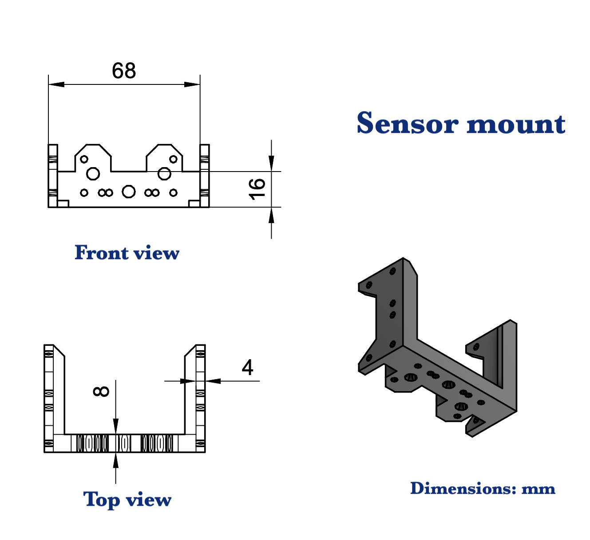
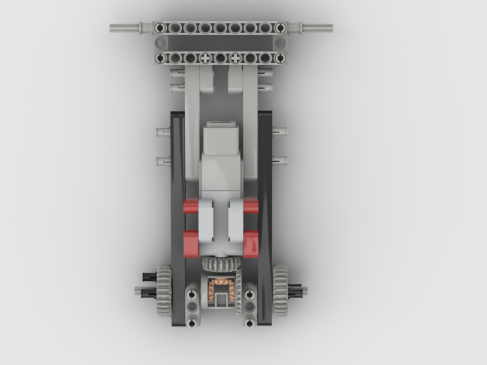
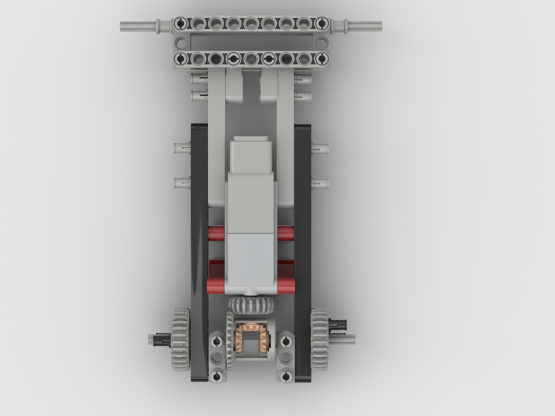
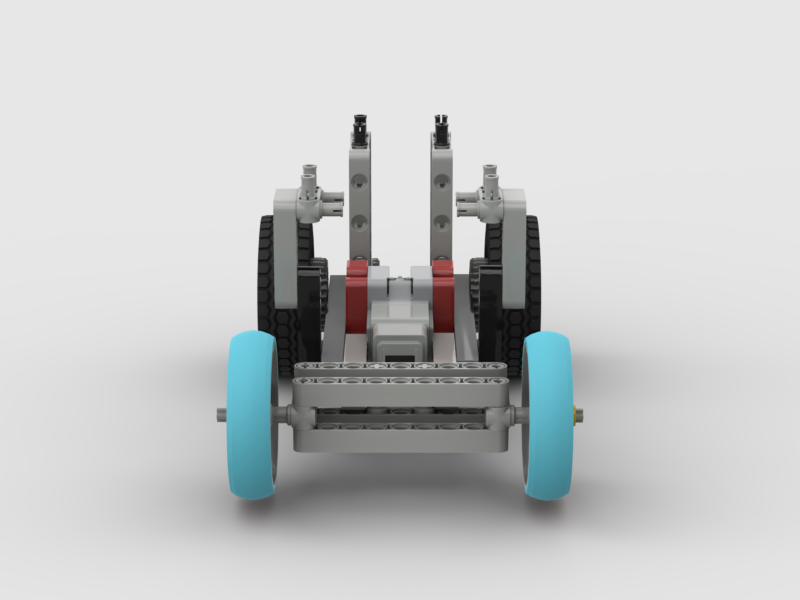
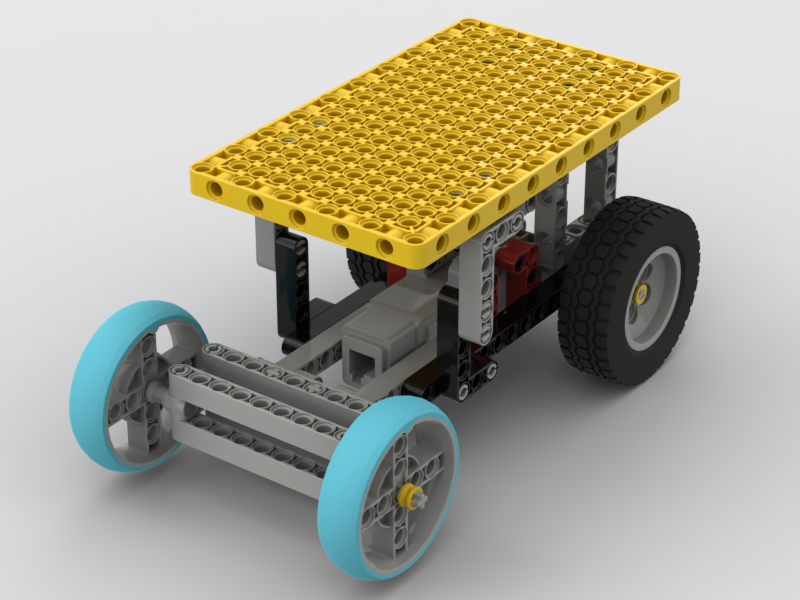

This directory contains the following schematic diagrams

- Wiring diagrams
- 3D printed parts diagrams
- Base chassis design diagrams

 

- Circuit Diagram

- Motor Connection Diagram

- Camera arm mount

 
- Camera base mount

 
- Sensor mount

- Servo motor mount

- Servo horn mount

- Chassis step 1 (top)

- Chassis step 1 (bottom)

- Chassis step 1 (iso)

- Chassis step 2 (front)

- Chassis step 3 (iso)

